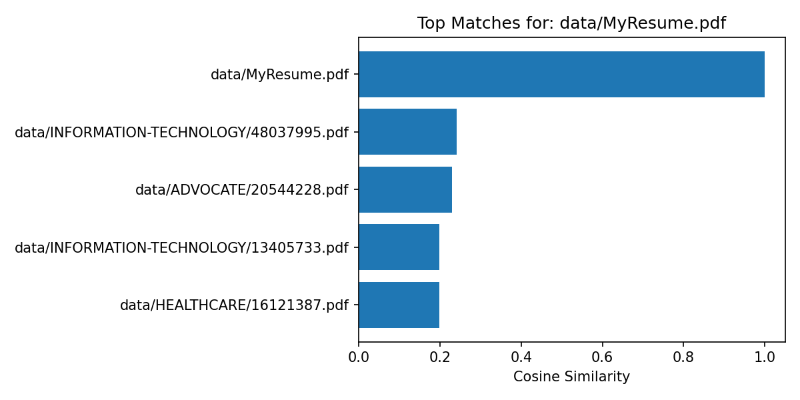

# Resume Similarity & Document Matching

## Project Overview
This project analyzes resume similarity using **TF-IDF** and **cosine similarity**.  
It compares resumes against each other (and optionally against job descriptions), ranks them by match score, and outputs both tables and visualizations.  
Built with **Python, scikit-learn, pandas, matplotlib, and NLTK**, the project supports PDF and TXT inputs for flexible document analysis.

---

## Tech Stack

-   
-   
-   
-   
-   
- 

---

## How to Reproduce

You can run this project directly in Google Colab without installing anything locally.

### Steps

1. Open the notebook in Colab using the badge above.  
2. In the left sidebar (📁), navigate to `/content/data/resumes/`.  
3. Right-click → **Upload** your own resumes (PDF or TXT).  
   - Nested subfolders are supported (e.g., `accountant/`, `banking/`).  
4. (Optional) Add a job description file into `/content/data/jobs/` (PDF or TXT) for JD-to-resume matching.  
5. Run the notebook cells from top to bottom.  
6. Outputs will be generated under:
   - `reports/tables/DocSims.csv` – top matches for each resume.  
   - `reports/tables/TopMatches_MyResume.csv` – closest matches to `MyResume.pdf`.  
   - `reports/tables/JD_Matches.csv` – (optional) matches between a job description and resumes.  
   - `reports/figures/resume_similarity.png` – visualization of similarity scores.  

### Notes
- Resumes should be **text-based PDFs** or `.txt` files.  
- Scanned/image-only PDFs may not extract properly.  
- Processing large datasets (hundreds/thousands of resumes) may take several minutes.  

---

## 📊 Results

After processing 2,484 resumes with TF-IDF and cosine similarity:

- [**DocSims.csv**](reports/tables/DocSims(1).csv): Top-5 most similar resumes for every document.  
- [**TopMatches_MyResume.csv**](reports/tables/TopMatches_MyResume.csv): Closest matches specifically to `MyResume.pdf`.  
- [**resume_similarity.png**](reports/figures/resume_similarity.png): Example visualization of top matches.  

### Example Visualization
Below is a sample plot showing the top similar documents for one resume:

---

## Why This Project Matters (HR / Recruiter Friendly)

- **For recruiters / HR teams**: Helps quickly identify resumes most relevant to a job description.  
- **For job seekers**: Test how well your resume aligns with different roles by comparing similarity to job descriptions.  
- **For hiring managers**: Reduce manual screening time by automatically surfacing top candidates.  

This project demonstrates **data-driven document analysis** — applying natural language processing (NLP) techniques to real-world hiring workflows.

---

## Future Enhancements

- Add support for **semantic embeddings** (e.g., BERT/SentenceTransformers) for deeper context beyond TF-IDF.  
- Expand visualization with interactive dashboards (Plotly or Streamlit).  
- Enable multi-job description comparisons.  
- Integrate keyword highlighting to show **which terms drive similarity scores**.  

---

## Author

**Veronica Carr**  
- MBA + M.S. in Computer Science/Data Analytics (in progress)  
- Based in Illinois, USA  
- Experienced in project coordination, operations management, and data-driven solutions  
- [LinkedIn](https://www.linkedin.com/in/veronica-carr-613931214/) | [GitHub](https://github.com/Veronicacarr22)

---
